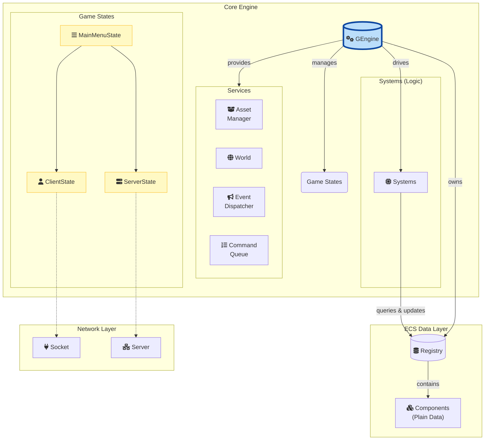
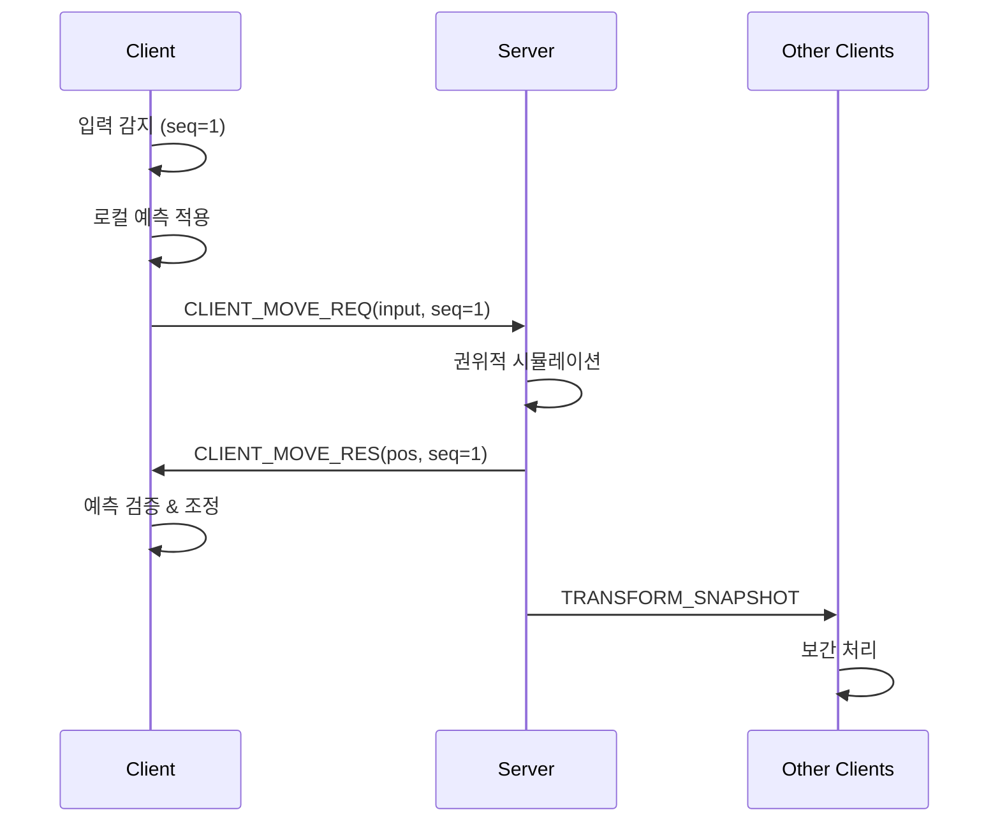

[](https://github.com/yehsi2000/factorygame/actions/workflows/cmake-multi-platform.yml)

# Factory Game - 멀티플레이어 팩토리 시뮬레이션


팩토리오에서 영감을 받은 **실시간 멀티플레이어** 2D 자동화 게임. 자체 제작한 ECS 아키텍처 위에, 클라이언트 예측(Client-Side Prediction) 기반의 네트워크 동기화 시스템 구현을 목표로 프로젝트를 진행하고 있습니다. 이를 통해 낮은 지연시간과 부드러운 게임플레이를 제공하는 견고한 기반을 구축했습니다.

## 개발 동기 및 과정

이 프로젝트는 C++ 언어를 깊이 파고들며 가장 효율적인 게임 시스템 설계를 고민하고 실제로 구현하며 그 원리를 체득하기 위해 시작하였습니다. 특히 서버 프로그래머라는 목표를 세운 후, 2주 남짓한 짧은 기간 안에 기존의 싱글플레이 ECS 엔진 위에 IOCP 기반의 비동기 네트워크 시스템을 통합하는 도전을 진행했습니다. 이 과정을 통해 복잡한 시스템을 확장하는 능력과 대규모 온라인 게임에 필요한 아키텍처에 대한 깊은 이해를 얻을 수 있었습니다.

## 기술적 성장 및 고민

이 프로젝트는 게임 서버 프로그래머로서 성장하기 위해 마주한 기술적 과제들과 이를 해결하기 위한 고민의 결과물입니다. 각 기능은 단순히 구현하는 것을 넘어, 성능, 구조, 확장성을 깊이 있게 고려하여 설계되었습니다.

### 1. 실시간 네트워크 동기화 및 서버 아키텍처

안정적인 멀티플레이어 환경을 구축하기 위해 네트워크 처리 방식에 많은 노력을 기울였습니다.

- **서버 권위적(Server-Authoritative) 구조와 클라이언트 예측**
    단순한 패킷 전송을 넘어, 서버가 모든 상태를 결정하는 **서버 권위적 구조**를 도입하여 치팅에 대응했습니다. 동시에 사용자의 입력에 즉각적으로 반응하는 것처럼 보이도록 **클라이언트 측 예측(Client-Side Prediction)**과 서버의 상태 값으로 클라이언트를 보정하는 **서버 보정(Reconciliation)** 기법을 적용했습니다. 이를 통해 불안정한 네트워크 환경에서도 부드러운 이동 동기화를 구현하며 실시간 온라인 게임의 핵심 기술 과제를 해결하는 경험을 쌓았습니다.

- **PIMPL 패턴을 이용한 크로스플랫폼 소켓 설계**
    Windows의 IOCP, Linux의 epoll 등 플랫폼마다 다른 소켓 API를 동시에 지원하기 위해 **PIMPL(Pointer to Implementation) 패턴**을 도입했습니다. `Socket`과 `Server` 인터페이스(`include/Core/Socket.h`, `src/Core/Server.cpp`)는 공통 로직을 담당하고, 플랫폼별 상세 구현(`WindowsServerImpl`, `LinuxServerImpl`)은 내부 구현 클래스로 분리했습니다. 이를 통해 플랫폼 종속적인 코드를 격리하여 코드의 재사용성과 확장성을 높였습니다.

- **네트워크 효율성 증대**
  - **대역폭 최적화**: 패킷 구조를 직접 설계하며 필요한 데이터만 정확히 포함하도록 **바이트 단위로 메모리를 할당하고 조작**했습니다. 이를 통해 불필요한 데이터 전송을 최소화하여 네트워크 대역폭 사용을 최적화했습니다.
  - **IOCP Completion Key 활용**: Windows 환경에서 IOCP 모델을 사용할 때, `CompletionKey`에 클라이언트 식별 정보를 담아 전달했습니다. 덕분에 비동기 작업 완료 통지를 받았을 때 어떤 클라이언트로부터 온 요청인지 즉시 식별하여 효율적으로 처리할 수 있었습니다.
  - **클라이언트별 OVERLAPPED 구조체**: 각 클라이언트의 `WSASend`, `WSARecv` 비동기 작업마다 별도의 `OVERLAPPED` 구조체를 할당했습니다. 이를 통해 다수의 클라이언트가 동시에 요청을 보내더라도 각 I/O 작업을 독립적으로 추적하고 관리하여 안정적인 비동기 통신을 구현했습니다.

### 2. 성능 최적화

게임의 전반적인 성능을 향상시키기 위해 병목 현상이 발생할 수 있는 지점을 분석하고 다음과 같이 개선했습니다.

- **드로우 콜 감소를 위한 청크 기반 스프라이트 캐싱**
    월드의 타일을 하나씩 그리는 방식은 막대한 드로우 콜을 유발합니다. 이 문제를 해결하기 위해 `World`(`include/Core/World.h`)가 8x8 크기의 청크를 생성할 때, 해당 청크에 포함된 모든 타일 스프라이트를 하나의 텍스처로 병합하여 캐싱하는 기법을 도입했습니다. 그 결과, 수백 개의 타일을 단 한 번의 드로우 콜로 처리할 수 있게 되어 렌더링 성능을 크게 향상시켰습니다.

- **불필요한 연산 방지를 위한 InactiveComponent**
    화면 밖에 있거나 현재 상호작용이 없는 엔티티까지 매 프레임 모든 시스템이 순회하며 업데이트하는 것은 큰 낭비입니다. 이를 방지하기 위해 `InactiveComponent`(`include/Components/InactiveComponent.h`)를 도입했습니다. 이 컴포넌트가 부착된 엔티티는 움직임, 렌더링 등 불필요한 로직을 건너뛰도록 하여 CPU 자원을 효율적으로 사용하도록 개선했습니다.

- **오브젝트 풀링을 통한 메모리 할당 오버헤드 감소**
    타이머와 같이 생성과 소멸이 빈번한 객체는 동적 메모리 할당에 따른 오버헤드를 유발합니다. 이를 해결하기 위해 `TimerManager`(`include/Core/TimerManager.h`)에 **오브젝트 풀(`ObjectPool`)**(`include/Core/ObjectPool.h`)을 도입했습니다. 미리 생성된 타이머 객체를 재사용함으로써 런타임 중 메모리 할당 및 해제 비용을 최소화하고, 가비지 컬렉션 부하를 줄여 성능을 안정시켰습니다.

- **AssetManager를 통한 텍스처 I/O 최소화**
    동일한 텍스처를 여러 번 로드하는 것은 불필요한 디스크 I/O를 발생시킵니다. `AssetManager`(`include/Core/AssetManager.h`)는 한 번 로드한 텍스처를 내부에 캐싱하여, 이후 동일한 텍스처 요청 시 메모리에 저장된 객체를 즉시 반환합니다. 이를 통해 I/O 작업을 최소화하고 로딩 속도를 개선했습니다.

### 3. 확장성 및 유지보수를 위한 소프트웨어 설계

코드의 결합도를 낮추고 유연한 구조를 만들기 위해 다음과 같은 설계 패턴과 아키텍처를 적용했습니다.

- **ECS 아키텍처의 한계 극복**
  - **TimerManager와 TimerExpireSystem**: ECS 패턴에서는 일반적으로 엔티티 하나에 동일한 타입의 컴포넌트를 여러 개 붙일 수 없습니다. 만약 `TimerComponent`에 타이머 로직을 모두 담았다면, 하나의 엔티티는 한 종류의 타이머만 가질 수 있었을 것입니다. 이 한계를 극복하고 타이머 로직을 컴포넌트에서 분리하기 위해 `TimerManager`와 `TimerExpireSystem`(`include/System/TimerExpireSystem.h`)을 별도로 구현했습니다. 이를 통해 어떤 엔티티든 여러 종류의 타이머를 제한 없이 생성하고 관리할 수 있게 되었습니다.

- **결합도 감소를 위한 중앙 관리 시스템**
  - **엔진 소유의 InputManager**: 각 시스템이 개별적으로 입력을 처리하면 코드가 중복되고 시스템 간 결합도가 높아집니다. 이를 해결하기 위해 엔진(`GEngine`)이 소유하는 중앙 `InputManager`(`include/Core/InputManager.h`)를 도입했습니다. 입력 처리를 한곳으로 집중시켜 모든 시스템이 중복 없이 동일한 입력 상태를 참조하게 함으로써 코드의 일관성과 유지보수성을 높였습니다.
  - **CommandQueue를 이용한 지연 실행**: 시스템이 엔티티를 순회하며 처리하는 도중 다른 엔티티나 컴포넌트가 변경되면 예측 불가능한 오류(예: 반복자 무효화)가 발생할 수 있습니다. 이를 방지하기 위해 **커맨드 큐(`CommandQueue`)**(`include/Core/CommandQueue.h`)를 도입했습니다. UI 입력에 따른 아이템 생성이나 파괴 같은 로직을 즉시 실행하지 않고 커맨드로 만들어 큐에 넣으면, 게임 루프의 안전한 시점에서 순차적으로 실행하여 데이터의 일관성을 보장하고 시스템 간의 결합도를 낮췄습니다.

- **유연한 게임 상태 관리를 위한 스택 기반 FSM**
    `GEngine`(`include/Core/GEngine.h`)은 **상태 스택(State Stack)**을 이용해 게임의 여러 상태(메인 메뉴, 인게임, 일시정지 등)를 관리합니다. `PushState`, `PopState`와 같은 인터페이스를 통해 상태를 전환하며, `PauseState`처럼 이전 상태를 유지한 채 새로운 상태를 잠시 실행했다가 다시 돌아오는 로직을 손쉽게 구현할 수 있는 확장성 있는 구조를 마련했습니다.

## 주요 기술적 특징

### 게임 기능

- **2D 팩토리 시뮬레이션**: 자원 채굴, 가공, 자동화 시스템
- **청크 기반 월드**: 8x8 타일 청크로 구성된 절차적 생성 월드
- **실시간 멀티플레이어**: 최대 N명의 동시 접속 지원

### 기술 스택

- **고성능 ECS 아키텍처**: Data-Oriented Design 기반의 캐시 친화적 구조
- **네트워크 동기화**: 클라이언트 예측 및 서버 조정(Reconciliation) 구현
- **멀티스레드 네트워킹**: 논블로킹 I/O와 스레드 안전 큐를 활용한 고성능 통신
- **실시간 렌더링**: SDL2 기반 하드웨어 가속 렌더링
- **Modern C++20**: 템플릿 메타프로그래밍, 스마트 포인터, 표준 라이브러리 활용

## 시스템 아키텍처

### 고성능 ECS (Entity-Component-System) 설계



### ECS 아키텍처 핵심 설계

**Data-Oriented Design을 통한 성능 최적화:**

- **Entity**: 단순 ID (unsigned long long) - 메모리 오버헤드 최소화
- **Component**: POD 구조체 - 캐시 라인 최적화
- **System**: 순수 로직 처리기 - 데이터와 로직의 완전한 분리

**핵심 최적화 기법:**

1. **연속 메모리 배치**: ComponentArray를 통한 캐시 친화적 데이터 저장
2. **효율적인 쿼리**: 가장 작은 ComponentArray부터 순회하여 불필요한 반복 최소화
3. **배치 처리**: 동일 타입 컴포넌트들을 연속적으로 처리하여 CPU 분기 예측 최적화

```cpp
// 실제 구현 예시
template<typename T>
class ComponentArray {
    std::vector<T> components;  // 연속 메모리
    std::unordered_map<EntityID, size_t> entityToIndex;
    // 캐시 미스를 최소화하는 구조
};
```

## 네트워크 아키텍처

### 실시간 멀티플레이어 동기화 시스템


**클라이언트-서버 아키텍처 - 이동 예측 및 조정:**



**핵심 동기화 매커니즘:**

1. **클라이언트 예측 (Client-Side Prediction)**:
    - 플레이어 입력이 발생하면, 클라이언트는 서버의 응답을 기다리지 않고 즉시 로컬에서 움직임을 시뮬레이션합니다.
    - 이 예측된 상태는 `NetPredictionComponent`에 저장되며, 렌더링 시 부드러운 보정을 거쳐 화면에 표시됩니다.
    - 동시에, 입력 데이터는 시퀀스 번호와 함께 서버로 전송됩니다 (`CLIENT_MOVE_REQ`).

2. **서버 권위 및 조정 (Server Reconciliation)**:
    - 서버는 모든 클라이언트의 입력을 받아 권위있는 시뮬레이션을 실행합니다. `InputStateComponent`가 각 플레이어의 최신 입력을 관리합니다.
    - 시뮬레이션 결과(최종 위치)는 해당 입력을 보낸 클라이언트에게 다시 전송됩니다 (`CLIENT_MOVE_RES`).
    - 클라이언트는 수신한 서버의 상태와 이전에 예측했던 자신의 상태를 비교합니다. 오차가 감지되면, 서버의 위치를 기준으로 삼아 미처리된 입력들을 다시 실행(Replay)하여 현재 위치를 재조정합니다. 이 과정은 시각적 끊김을 최소화하기 위해 부드럽게 처리됩니다.

3. **엔티티 보간 (Entity Interpolation)**:
    - 로컬 플레이어를 제외한 다른 모든 플레이어(원격 엔티티)의 움직임을 부드럽게 표현하기 위해 사용됩니다.
    - 서버는 모든 플레이어의 위치 정보를 주기적으로 모든 클라이언트에게 브로드캐스트합니다 (`TRANSFORM_SNAPSHOT`).
    - 클라이언트는 이 정보를 `InterpBufferComponent`라는 버퍼에 저장하고, 약간의 지연을 두고 과거 시점의 위치를 보간하여 화면에 그립니다. 이를 통해 네트워크 지연(jitter)이나 패킷 손실로 인한 끊김 현상을 완화합니다.

### 주요 시스템 구성

**게임플레이 시스템:**

- MovementSystem, AnimationSystem, RenderSystem
- InputSystem, CameraSystem, InteractionSystem
- InventorySystem, MiningDrillSystem, AssemblingMachineSystem

**네트워크 시스템:**

- **ClientNetworkSystem**: 예측, 조정, 서버 통신 관리
- **ServerNetworkSystem**: 다중 클라이언트 관리, 권위적 상태 브로드캐스트

## 기술적 도전과제 및 해결방안

### 1. 네트워크 지연 시간 최소화

**문제**: 실시간 멀티플레이어에서 네트워크 지연으로 인한 조작감 저하

**해결책**:

- **Client-Side Prediction**: 입력 즉시 로컬에서 움직임 시뮬레이션
- **Input Buffering**: 시퀀스 번호를 통한 입력 명령 추적 및 재실행
- **Smooth Reconciliation**: 예측 오차 발생 시 부드러운 위치 보정

```cpp
// 실제 예측 오차 처리 로직 (ClientNetworkSystem.cpp)
float error = std::hypot(it->predX - serverX, it->predY - serverY);
if (error > 0.1f) {  // 오차 감지
  // 1. 서버의 권위적 위치로 예측 상태를 되돌립니다.
  pred.predictedX = serverX;
  pred.predictedY = serverY;

  // 2. 서버가 확인한 입력 이후의 모든 미확인 입력을 다시 실행합니다.
  for (auto replay_it = std::next(it); replay_it != pendingInputQueue.end(); ++replay_it) {
    ApplyPrediction(pred, move, world, replay_it->inputBit, replay_it->deltaTime);
    // 재실행된 예측 결과를 히스토리에 다시 저장합니다.
    replay_it->predX = pred.predictedX;
    replay_it->predY = pred.predictedY;
  }
}
```

### 2. ECS 쿼리 성능 최적화

**문제**: ECS 아키텍쳐에서 가장 자주 사용되는 컴포넌트 쿼리 및 조회의 낮은 성능

**해결책**:

- **Vector기반의 Cache친화적 구조**: 컴포넌트 조회에 처음엔 Hashmap을 이용해 등록된 Component의 typename으로 조회하였으나 캐시효율성이 떨어지고 프로파일링 결과 unordered_map의 문자열 hashing에서 병목이 발생하는 것을 확인하여 component가 등록될 때마다 증가하는 id를 부여해 vector와 같은 연속적 데이터 구조로 빠른 메모리 접근과 캐시 효율성 확보

- **Smallest-First 순회**: 여러 컴포넌트를 가진 엔티티를 조회할 때 가장 작은 ComponentArray부터 시작하여 조회 성능 최적화

### 3. 멀티스레드 동기화

**문제**: 비동기 네트워크 I/O에 따른 Race Condition을 방지하기 위해 Mutex를 도입하였으나 이로 인해 네트워크 인풋에 의해 게임에 미세한 딜레이 발생

**해결책**:

- **Thread-Safe Queue**: 네트워크 스레드와 게임 로직 스레드 간의 안전한 데이터 전달을 보장하는 동시에 conditional variable을 이용해 불필요한 경합과 Spinlock에 의한 CPU 소모를 줄이는 thread safe queue구현

### 월드 생성 및 관리


- **청크 기반 시스템**: 8x8 타일 청크로 효율적인 메모리 관리
- **절차적 생성**: FastNoiseLite를 통한 결정론적 지형 생성
- **동적 로딩**: 플레이어 위치 기반 청크 로드/언로드

## 빌드 및 실행

### 빌드 테스트 완료 환경

- **플랫폼**: Windows x64
- **컴파일러**: MSVC (Visual Studio 2022+), Clang 19.1.5
- **CMake**: 3.30+
- **C++ 표준**: C++20

- **플랫폼**: Ubuntu 22.04
- **컴파일러**: GNU Compiler 13.1.0
- **CMake**: 3.20+
- **C++ 표준**: C++20

### 빠른 시작

```bash
# 프로젝트 클론
git clone https://github.com/yehsi2000/factorygame.git
cd factorygame

# 빌드
cmake -B build -DCMAKE_BUILD_TYPE=Release
cmake --build build --config Release

# 서버 실행
./build/bin/FactoryGame.exe

# 테스트 실행
cmake --build build --target test
```

## 프로젝트 구조

```
FactoryGame/
├── include/              # 헤더 파일
│   ├── Components/       # ECS 컴포넌트 (POD 구조체)
│   ├── System/           # 게임 시스템 인터페이스
│   ├── Commands/         # Command 패턴 구현
│   ├── Core/             # 코어 엔진 (Registry, World, Network)
│   ├── GameState/        # 게임 상태 관리 (Client/Server)
│   ├── Util/             # 유틸리티 및 헬퍼
│   └── lib/              # 서드파티 라이브러리 헤더
├── src/                  
│   ├── System/           # 시스템 구현 (Client/ServerNetworkSystem 포함)
│   ├── Core/             # 엔진 구현
│   │   └── Network/      # 플랫폼별 네트워크 구현 (Windows/Linux)
│   ├── GameState/        # 클라이언트/서버 상태 구현
│   ├── Util/             # 유틸리티 구현
│   └── lib/              # ImGui 구현 파일
├── assets/               # 게임 리소스
│   ├── img/              # 스프라이트, 아이콘
│   └── docs/             # 문서 리소스
├── tests/                # 단위 테스트
├── vendored/             # 서드파티 라이브러리
│   ├── SDL/              # SDL2 소스
│   ├── SDL_image/        # SDL2_image 소스
│   └── SDL_ttf/          # SDL2_ttf 소스
└── build/                # CMake 빌드 출력
```

## 향후 개발 계획

### 1. 네트워크 안정성 강화

현재 구현된 IOCP 기반 서버의 안정성과 확장성 개선:

- **패킷 검증 시스템**: 악의적인 패킷 필터링 및 DDoS 방어 로직
- **세션 관리 고도화**: 비정상적인 연결 종료에 대비한 세션 관리 및 데이터 복구 로직 구현
- **패킷 암호화 및 검증**: 패킷 기본 암호화 및 패킷 유효성 검증 시스템 도입
- **에러 핸들링 고도화**: 각 에러 상황별 graceful shutdown 및 복구
- **스트레스 테스트**: 다수의 더미 클라이언트를 통해 서버의 한계 성능을 측정하고, 프로파일링을 통해 병목 지점을 분석 및 개선

### 2. 모니터링 및 로깅 시스템

서버 운영 경험을 바탕으로 실시간 모니터링 구현:

- **성능 메트릭 수집**: 동시 접속자 수, 패킷 처리량, 레이턴시 측정
- **로그 레벨링**: Debug/Info/Warning/Error 레벨별 파일 출력
- **간단한 웹 대시보드**: 기존 nginx 경험을 활용한 모니터링 페이지

### 3. 게임 서버 기능 확장

- **채팅 시스템 개선**: 채널별 채팅, 귓속말, 채팅 필터링
- **매치메이킹**: 플레이어 레벨/지역 기반 간단한 매칭 시스템
- **데이터 영속성**: 플레이어의 진행 상황(위치, 인벤토리 등)을 안정적으로 저장하고 불러오기 위한 간단한 DB(SQLite, Redis 등) 연동 계획

이러한 계획들은 현재 구현한 IOCP와 네트워크 프로그래밍 기초를 바탕으로, 실제 서비스 가능한 수준의 게임 서버로 발전시키는 것을 목표로 합니다.

## 개발 환경 및 도구

- **IDE**: Visual Studio Code
- **버전 관리**: Git, GitHub
- **빌드 시스템**: CMake 3.30+
- **테스트**: CTest
- **CI/CD**: GitHub Actions