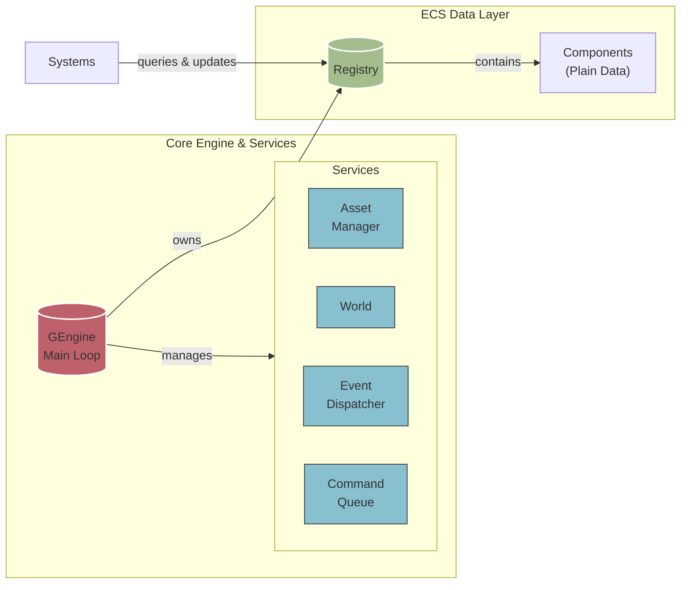
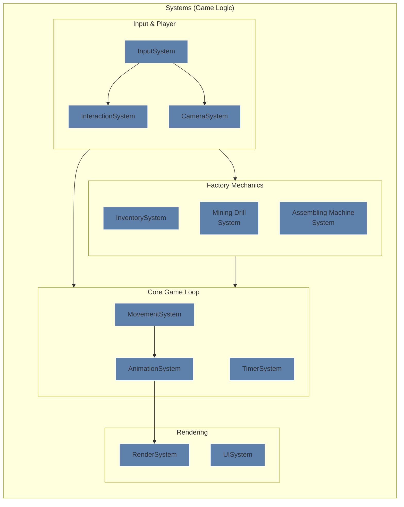

# Factory Game


팩토리오에서 영감을 받은 2D 채굴 및 자동화 게임. 자체 제작한 ECS 아키텍처를 기반으로 구축하였으며, 향후 Windows 시스템 프로그래밍 기능을 활용한 성능 최적화가 계획되어 있음.

## Feature

- **2D 팩토리 시뮬레이션**: 자원 채굴, 가공, 자동화 시스템
- **청크 기반 월드**: 8x8 타일 청크로 구성된 절차적 생성 월드
- **ECS 아키텍처**: 순수 Entity-Component-System 패턴 구현
- **실시간 렌더링**: SDL2 기반 하드웨어 가속 렌더링
- **ImGui 통합**: 인게임 UI

## Game Architecture

# FactoryGame Architecture





### ECS (Entity-Component-System) Structure

순수 ECS 패턴을 사용하여 높은 성능과 유연성을 제공:

```
Entity - 단순한 숫자 ID (EntityID = unsigned long long)
Component - 순수 데이터 구조체 (include/Components/)
System - 로직 처리기 (include/System/, src/System/)
```

Component를 저장하고 처리하는 부분은 Map이 아닌 ComponentArray 템플릿을 이용해 연속적인 메모리에 저장 -> Data-Oriented-Design

특정 Component들을 공통으로 가지는 ComponentArray를 가져오기 위해 가장 size가 작은 ComponentArray에서 주어진 컴포넌트를 가지고 있지 않은 Entity를 제외함으로써 Query 성능 향상

> [!INFO]
> 로직과 데이터를 분리함으로써 로직에 필요한 데이터를 한꺼번에 불러와 Cache Hit Rate를 높임
> 다수의 엔티티를 동시에 처리하기에 적합한 구조

### System

- **RenderSystem**: 청크 및 엔티티 렌더링, 카메라 변환
- **CameraSystem**: 플레이어 추적 및 마우스 드래그 카메라 제어
- **MovementSystem**: 물리 및 이동 처리
- **AnimationSystem**: 스프라이트 애니메이션 관리
- **InputSystem**: 입력 처리 (마우스 카메라 제어 포함)
- **TimerSystem/TimerExpireSystem**: 시간 기반 이벤트 관리
- **InteractionSystem**: 엔티티 상호작용 로직
- **InventorySystem**: 아이템 관리 및 인벤토리 연산
- **ResourceNodeSystem**: 채굴 노드 처리
- **RefinerySystem**: 자원 정제 연산
- **AssemblingMachineSystem**: 조립 기계 관리 및 생산 처리
- **MiningDrillSystem**: 채굴기 관리
- **UISystem**: ImGui를 사용한 사용자 인터페이스

### World


- **청크 기반 아키텍처**: Minecraft와 유사한 8x8 타일 그리드
- **절차적 생성**: FastNoiseLite를 사용한 좌표값 기반 지형 및 광물 군집 생성
- **뷰 거리**: 설정 가능한 청크 로딩 반경 (기본값: 2청크)
- **타일 기반**: 각 청크는 지형을 위한 TileData 그리드 포함

### Event & Command

- **EventDispatcher**: 시스템 간 즉시 통신이 필요한 경우 사용하는 이벤트 기반 아키텍처
- **CommandQueue**: 이벤트 처리 중 시스템 간섭을 방지하기 위한 안전한 지연 실행 큐
- **분리된 통신**: 이벤트는 즉시 전파, 커맨드는 안전한 타이밍에 실행하여 시스템 결합도 최소화

> [!NOTE]
> 즉각적인 반응이 필요한 입력 처리(Event)와 게임 월드의 일관성을 해치지 않아야 하는 로직(Command)을 분리하여,
> 복잡한 상호작용 속에서도 데이터의 안정성을 확보하고 디버깅을 용이하게 하기 위해 EventDispatcher CommandQueue를 분리

## 빌드 시스템

### 요구사항

- **컴파일러**: MSVC (Visual Studio 2022 권장)
- **CMake**: 3.30 이상
- **C++ 표준**: C++20
- **플랫폼**: Windows (x64)

### Dependency

- **SDL2 & SDL2_image & SDL2_ttf**: 그래픽 및 윈도우 관리 (vendored/에 SDL, SDL_image, SDL_ttf 소스코드를 각각 파일명으로 추가)
- **Boost**: 일반 유틸리티 (시스템 설치, find_package를 통해 탐지)
- **ImGui**: Immediate Mode GUI (src/lib/)
- **FastNoiseLite**: 절차적 타일 생성

### Build Command

``` bash
# 구성
cmake -B build -DCMAKE_BUILD_TYPE=Debug

# 빌드
cmake --build build

# 정리
cmake --build build --target clean

# 테스트
cmake --build build --target test

# 실행 파일: build/bin/FactoryGame.exe
```

## Project Structure

```
FactoryGame/
├── include/           # 모든 헤더 파일
│   ├── Components/    # ECS 컴포넌트 정의
│   ├── System/        # 시스템 클래스 헤더
│   ├── Commands/      # 커맨드 종류
│   ├── Core/          # 엔진 핵심 클래스
│   ├── lib/           # 서드파티 라이브러리 헤더
│   └── Util/          # 유틸리티 클래스 및 헬퍼
├── src/              # 구현 파일
│   ├── System/       # 시스템 구현
│   ├── Core/         # 핵심 엔진 구현
│   ├── Util/         # 유틸리티 구현
│   └── lib/          # 서드파티 라이브러리 구현
├── assets/           # 게임 에셋 (아이콘, 스프라이트)
├── tests/            # 유닛 테스트
├── vendored/         # 서드파티 의존성
└── build/            # CMake 빌드 출력
```

## 향후 개발 계획: Windows 시스템 프로그래밍 통합

### 1. 멀티스레드 시스템 업데이트 (Thread Synchronization)

현재 단일 스레드로 동작하는 시스템들을 병렬화하여 성능을 향상시킬 예정

**계획된 구현:**

- **Critical Section**: 컴포넌트 배열 접근 동기화
- **Reader-Writer Lock**: 읽기 작업이 많은 렌더링 시스템 최적화
- **Event 객체**: 시스템 간 작업 완료 신호 전달
- **Thread Pool**: 독립적인 시스템들의 병렬 실행

**적용 대상 시스템:**

- MovementSystem과 AnimationSystem 병렬 실행
- World의 청크 생성 별도의 스레드에서 진행
- RenderSystem의 청크별 렌더링 작업 분산

### 2. Memory-Mapped File 기반 세이브/로드 시스템

이후 구현이 계획된 세이브 시스템을 Windows MMF를 활용하여 고성능으로 구현:

**기술적 접근:**

- **CreateFileMapping()**: 세이브 파일을 메모리에 직접 매핑
- **MapViewOfFile()**: 청크 단위로 필요한 부분만 로딩
- **VirtualAlloc()**: 대용량 세계 데이터의 효율적 메모리 관리

```cpp
// 예상 구현
class World {
    HANDLE hMapFile;
    LPVOID pChunkData;
public:
    void SaveChunk(const ChunkData& chunk, Vec2 chunkPos);
    ChunkData LoadChunk(Vec2 chunkPos);
    void FlushToDisk();
};
```

**장점:**

- 대용량 월드 데이터의 스트리밍 로딩
- OS 페이지 캐시 활용으로 빠른 액세스
- 청크별 지연 로딩으로 메모리 사용량 최적화

### 3. 기타 Windows 시스템 프로그래밍 활용

**리소스 관리:**

- **Heap API (HeapCreate, HeapAlloc)**: ECS 컴포넌트풀 전용 힙 생성

**입출력 최적화:**

- **Overlapped I/O**: 에셋 로딩의 비동기 처리

## 개발 패턴

### 컴포넌트 등록

모든 컴포넌트는 `GEngine::RegisterComponent()`에 등록되어야 함

### 시스템 초기화

시스템들은 `GEngine::InitCoreSystem()`에서 초기화됨

### 엔티티 생성

`Registry::CreateEntity()`를 사용하고 `AddComponent()` 또는 `EmplaceComponent()`로 컴포넌트를 추가
기본적으로 엔티티 생성 로직은 `EntityFactory` 유틸리티에 포함

### 메모리 관리

ECS 구조의 효율적인 메모리 사용을 위해 엔티티 ID 재사용과 함께 컴포넌트 풀을 사용

## Coordinate System

- **World Coordinate**: 부동소수점 기반 월드 공간 위치 (Vec2f)
- **Screen Coordinate**: 디스플레이를 위한 SDL 렌더러 좌표
- **Tile Index**: 월드 타일을 위한 정수 그리드 위치 (Vec2)
- **Chunk Index**: 8x8 청크 그리드를 위한 정수 위치

`World` 클래스가 시스템 간의 좌표 변환을 처리
